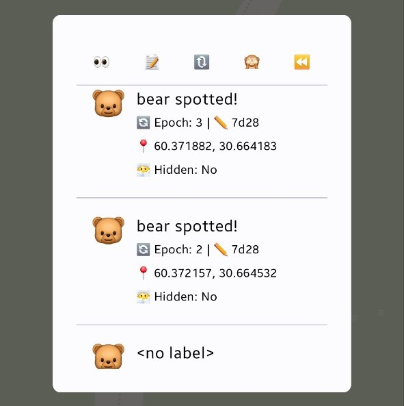

  
  
  

  <h4>OSMastic — Off-grid map editing prototype. Works over independent radio, no cell towers.</h4>

#### Exploring consistency and convergence in a decentralized LoRa mesh. No central node, no TCP, no global truth.

## Technologies used:
- **[LoRa Alliance](https://lora-alliance.org/)** — radio
- **[Meshtastic](https://meshtastic.org/)** — transport layer and LoRa device firmware
- official **[Android app](https://github.com/meshtastic/Meshtastic-Android)** — AIDL
- **[protobuf](https://protobuf.dev/)** — data serialization protocol
- **[CRDT](https://crdt.tech/)** — local and foreign data merging concept
- **[OpenStreetMap](https://www.openstreetmap.org/)** & **[Voyager tiles](https://carto.com/blog/new-voyager-basemap/)** — map data
- **[osmdroid](https://github.com/osmdroid/osmdroid)** — map widget, offline tiles
- **[Android Studio](https://developer.android.com/studio)** — IDE
- **[Kotlin](https://kotlinlang.org/)**
- **[Hilt, KSP, Room](https://developer.android.com/jetpack)** — instruments
- **[Compose](https://developer.android.com/jetpack/compose)** — UI & UI state management

---

  
  

#### Quick demonstration of the app features: pin selection from list, map tiles caching, GPS, pin rotation.

---

## Features:
- Kotlin + Jetpack Compose used;
- Local-first, Multi-Value pin register (history) with only winner pin rendered;
- Uses AIDL interface of the official Meshtastic app;
- CRDT: classic LWW, but no timestamps — logical counter and Time To Live for pins;
- TTL is static, once set — unchangeable;
- TTL on all rebroadcasts gets recalculated for the nodes, that missed initial creation event packet.
- 4-byte entropy for random logical IDs;
- Tie-breaking: static relationships between every two nodes in a channel known to everyone: PSK+NodeID --> MD5 hashing;
- Map widget is the old osmdroid, custom Marker class (visible label, metadata injected);
- Supports rotation, GPS, region caching with UI indication in Layers modal;
- Pins can be rotated, labeled, emojis allowed as icons, dimmed (if stale), moved;
- Full pin history in modal, no information gets dropped on stale or conflict events;
- Voyager map tiles, light variant. 

---

#### Quick demonstration of the app features: pin selection from list, editing, dimming, configuring expiration period.

  

#### Pin Version History – Multi-Value Register.

  

All pin updates are retained — **stale and conflicting ones too**. The mesh operates over a slow, unreliable channel with no metadata, no redundancy, and no delivery guarantees. The system attempts to resolve conflicts automatically, render the most **likely** consistent truth, but the final authority will remain with the user (view-only currently).

---

## Planned improvements:
- [x] README
- [ ] conflict detection indicator
- [ ] on conflict detected rebroadcasting button
- [ ] fix two-way async callback hell -> MVI
- [ ] ugly edit UI coroutine pause redo
- [ ] disable broadcasting on edit modal dismiss
- [ ] green/red dot latest map caching result
- [ ] emoji rotation indicator on edit modal ( or on the map directly )
- [ ] mapnik/voyager/sat switch
- [ ] light/dark themes (where supported)
- [ ] drop tiles cache button - taken space indicator
- [ ] ugly edit modal UI redo
- [ ] ugly bottom bar with buttons UI redo
- [ ] meshtastic channels switch support (currently uses 0 or primary one) (possible problems with delivery)
- [ ] another radio layer switch ( gprc relay server, wifi udp, bluetooth, DMR custom, etc.)
- [ ] gps not ready button deadlock fix -> add condition GPS allowed check
- [ ] maplibre switch, when its markers ready (not in this lifetime)
- [ ] delete persistent (no TTL was set) pins button (local!)
- [ ] add logical id collision preflight check
- [ ] add automatic rebroadcast on conflicts? for stale pins
- [ ] link to previous state built into message? light optional causality based on (lamport - editorMark)
- [ ] dark/light theme switch and rotation: osmdroid recomposes and dies -> fix hoisting
- [ ] icon
- [ ] TDD: unit tests for sync. logic
- [ ] clean every ugly comment
- [ ] history: manual winner set, local only.
- [ ] wrap Pin insertion + winner selection in Room transaction (withTransaction)
- [ ] add fields defaults directly into DB scheme (@ColumnInfo(defaultValue = "") in entities)
